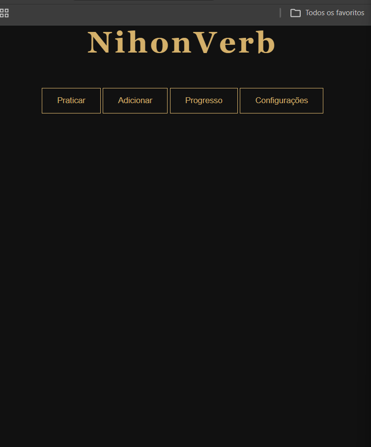
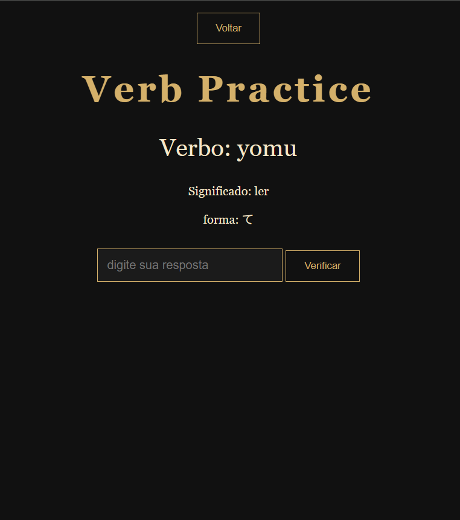

## 📌 About the Project

NihonVerb is a web application created to help practice Japanese verb conjugation.

The idea came from my own experience studying Japanese, where I found it difficult to memorize and practice different verb forms.  
So I decided to build this project as a way to combine programming practice with language learning.

---

## 🚀 Current Features

- Random verb generation
- Practice using the **te-form (て-form)**
- User input for answers
- Instant feedback (correct / incorrect)
- Incorrect answers repeat until correct
- Training ends when all verbs are answered correctly
- Automatic reset after finishing
- Displays verb meaning
- Enter key support for faster interaction

---

## 🚧 Project Status

This project is still in development.

At the moment, it works as a base for learning:

- Front-end and back-end integration
- API development
- Application logic
- Code structure inspired by Clean Architecture

---

## 🔮 Future Improvements

Some ideas I plan to implement:

- Support for more verb forms:
  - Masu form (ます)
  - Past tense
  - Negative form
- Progress tracking system
- Training configuration (amount, verb type, etc.)
- Accept answers in:
  - Hiragana
  - Kanji
  - Romaji
- Database integration
- Allow users to add their own verbs
- UI improvements with a Japanese-inspired design

---

## 🎯 Purpose

This project was developed as a personal project with two main goals:

- Practice web development (especially back-end)
- Create a useful tool to support my Japanese studies

---

## 📸 Preview

Below are some screenshots of the current version of the application:

<p align="center">
  
</p>

<p align="center">
  
</p>

---

## 💻 How to Run Locally

```bash
npm install
node src/interface/server.js

